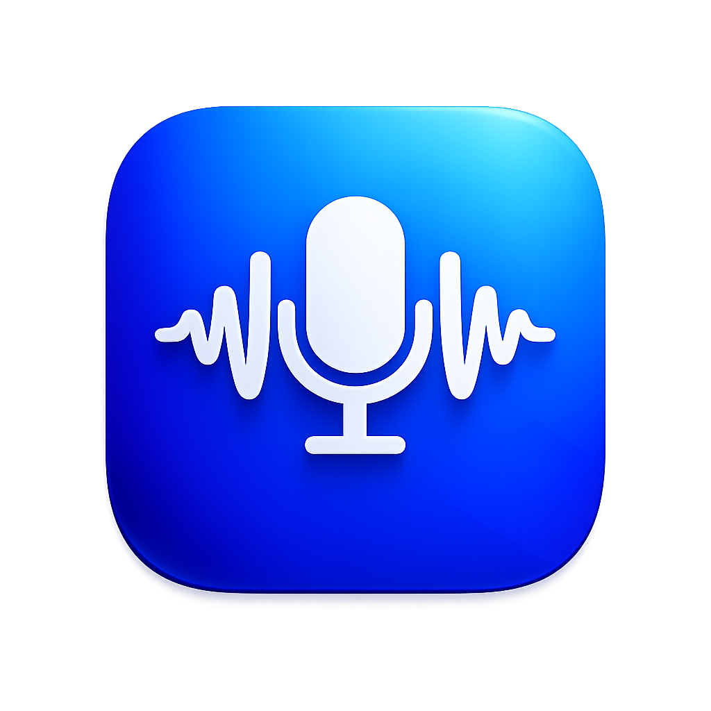

<p align="center">
  
</p>

<h1 align="center">Lanite</h1>

<p align="center">
  <strong>Privacy-First Offline Voice Dictation Engine for Windows</strong>
</p>

<p align="center">
  <a href="#features">Features</a> •
  <a href="#installation">Installation</a> •
  <a href="#usage">Usage</a> •
  <a href="#architecture">Architecture</a> •
  <a href="#contributing">Contributing</a>
</p>

<p align="center">
  
  
  
  
</p>

---

## Overview

Lanite is a native, offline push-to-talk voice dictation system designed for Windows. It provides instant, accurate speech-to-text transcription using OpenAI's Whisper model, with zero cloud dependency and complete data privacy.

Unlike cloud-based alternatives, Lanite processes all audio locally on your machine. Your voice data never leaves your computer, making it ideal for sensitive work environments, confidential communications, and users who value privacy.

The application runs silently in the background, activating only when you hold the designated hotkey combination. A minimalist popup indicator provides visual feedback during recording, and transcribed text is instantly injected into any active application via clipboard.

### Why Lanite?

- **Complete Privacy**: All processing happens locally. No internet required after initial setup.
- **Zero Latency Network Calls**: No waiting for cloud API responses.
- **Professional-Grade Accuracy**: Whisper's context-aware transcription handles punctuation, technical terms, and natural speech patterns automatically.
- **Minimal Footprint**: Lightweight architecture with CPU-optimized inference.
- **Instant Integration**: Works with any application that accepts text input.

---

## Features

| Feature | Description |
|---------|-------------|
| **Offline Processing** | 100% local inference using Whisper transformer models |
| **Push-to-Talk Activation** | Hold `Ctrl + Space` to record, release to transcribe |
| **Visual Indicator** | Non-intrusive popup shows recording status |
| **Smart Punctuation** | Automatic punctuation and capitalization |
| **Audio Feedback** | Configurable start/stop beeps |
| **Kill Switch** | `Ctrl + Shift + Space` terminates the application |
| **Single Instance Lock** | Prevents multiple processes from running simultaneously |
| **Automatic History Logging** | Optional transcription history saved locally |
| **Microphone Diagnostics** | Built-in utility for troubleshooting audio issues |

---

## Installation

### Prerequisites

- **Python 3.8+** (Python 3.10 recommended)
- **Windows 10/11**
- **Working microphone**
- **FFmpeg** (included via project-local binaries)

### Quick Start

```bash
# Clone the repository
git clone https://github.com/bhaveshmadisetty/lanite.git
cd lanite

# Create virtual environment
python -m venv venv
.\venv\Scripts\activate

# Install dependencies
pip install -r requirements.txt

# Run Lanite
python main.py
```

For detailed installation instructions, see [INSTALLATION.md](INSTALLATION.md).

---

## Usage

### Basic Operation

1. **Start the application**: Run `python main.py` or launch via desktop shortcut
2. **Activate recording**: Hold `Ctrl + Space`
3. **Speak clearly**: A popup indicator will appear in the bottom-right corner
4. **Release keys**: Transcription begins automatically
5. **Text injection**: Transcribed text is pasted into your active application

### Keyboard Shortcuts

| Shortcut | Action |
|----------|--------|
| `Ctrl + Space` (hold) | Start/continue recording |
| Release either key | Stop recording and transcribe |
| `Ctrl + Shift + Space` | Kill switch (terminate application) |

### Configuration

Edit `config.py` to customize behavior:

```python
# Model selection (affects accuracy vs speed)
DEFAULT_MODEL = "tiny.en"  # Options: tiny.en, base.en, small.en

# Audio feedback
BEEP_START_FREQ = 800  # Hz
BEEP_STOP_FREQ = 400   # Hz

# Performance tuning
BEAM_SIZE = 2          # Lower = faster, slightly less accurate
COMPUTE_TYPE = "int8"  # Quantization for CPU efficiency
```

For comprehensive usage documentation, see [USAGE.md](USAGE.md).

---

## Architecture

Lanite employs a multi-threaded architecture designed for real-time audio processing with minimal latency:

```
┌─────────────────────────────────────────────────────────────┐
│                        MAIN THREAD                          │
│                   (Tkinter Event Loop)                      │
└─────────────────────────────────────────────────────────────┘
                              │
        ┌─────────────────────┼─────────────────────┐
        ▼                     ▼                     ▼
┌───────────────┐   ┌─────────────────┐   ┌─────────────────┐
│  Key Listener │   │  Speech Engine  │   │     Popup       │
│    Thread     │   │    Threads      │   │    Manager      │
│               │   │                 │   │                 │
│ • Poll state  │   │ • Audio capture │   │ • Show/hide     │
│ • Trigger     │   │ • Queue buffer  │   │ • Update text   │
│   recording   │   │ • Whisper infer │   │                 │
│ • Kill switch │   │ • Clipboard     │   │                 │
└───────────────┘   └─────────────────┘   └─────────────────┘
        │                     │                     │
        └─────────────────────┴─────────────────────┘
                              │
                    ┌─────────▼─────────┐
                    │   Shared State    │
                    │   • listening     │
                    │   • active        │
                    │   • audio_queue   │
                    └───────────────────┘
```

### Key Components

| Module | Responsibility |
|--------|---------------|
| `main.py` | Entry point, single-instance lock, thread orchestration |
| `config.py` | Centralized configuration constants |
| `key_listener.py` | Hotkey detection and state management |
| `speech_engine.py` | Audio capture, Whisper inference, text injection |
| `popup.py` | Thread-safe Tkinter UI for visual feedback |
| `text_processor.py` | Post-processing utilities (optional) |
| `check_mic.py` | Microphone diagnostic utility |

For detailed technical documentation, see [ARCHITECTURE.md](ARCHITECTURE.md).

---

## Technical Stack

| Component | Technology |
|-----------|------------|
| **Speech Recognition** | faster-whisper (CTranslate2 optimized) |
| **Audio Capture** | sounddevice (PortAudio wrapper) |
| **Hotkey Detection** | keyboard library |
| **Text Injection** | pyperclip + keyboard simulation |
| **UI Framework** | tkinter (native Windows) |
| **Concurrency** | threading module with queue-based communication |

---

## Project Structure

```
lanite/
├── main.py                    # Application entry point
├── config.py                  # Configuration constants
├── key_listener.py            # Hotkey detection module
├── speech_engine.py           # Core speech recognition engine
├── popup.py                   # Visual indicator UI
├── text_processor.py          # Text cleanup utilities
├── check_mic.py               # Microphone diagnostic tool
├── create_desktop_shortcut.py # Windows shortcut generator
├── lanite_icon.png            # Application icon (PNG)
├── lanite_icon.ico            # Application icon (ICO)
├── requirements.txt           # Python dependencies
├── README.md                  # This file
├── ARCHITECTURE.md            # Technical design documentation
├── INSTALLATION.md            # Detailed setup guide
├── USAGE.md                   # Usage instructions
├── PROJECT_REPORT.md          # Development methodology
├── CHANGELOG.md               # Version history
├── ROADMAP.md                 # Future development plans
├── SECURITY.md                # Security policy
├── CODE_OF_CONDUCT.md         # Community guidelines
├── CONTRIBUTING.md            # Contribution guidelines
├── LICENSE                    # MIT License
└── .gitignore                 # Git ignore patterns
```

---

## Performance

Lanite is optimized for CPU inference on consumer hardware:

| Model | Size | RAM Usage | Latency (3s audio) | Accuracy |
|-------|------|-----------|-------------------|----------|
| tiny.en | ~75 MB | ~200 MB | ~0.5s | Good |
| base.en | ~150 MB | ~350 MB | ~1s | Excellent |
| small.en | ~500 MB | ~600 MB | ~2s | Best |

**Recommended**: Start with `tiny.en` for fastest response, upgrade to `base.en` if accuracy is critical.

---

## Troubleshooting

### Common Issues

**Microphone not detected**
```bash
python check_mic.py
```

**Text not pasting**
- Ensure target application has focus
- Check if clipboard permissions are blocked

**High CPU usage**
- Switch to `tiny.en` model
- Reduce `BEAM_SIZE` to 1 in `config.py`

**Application won't start**
- Check if another instance is running (single-instance lock)
- Verify all dependencies: `pip install -r requirements.txt`

---

## Contributing

Contributions are welcome! Please read [CONTRIBUTING.md](CONTRIBUTING.md) for guidelines on:

- Code style conventions
- Pull request process
- Development environment setup
- Testing requirements

---

## License

This project is licensed under the MIT License - see [LICENSE](LICENSE) for details.

---

## Acknowledgments

- [OpenAI Whisper](https://github.com/openai/whisper) - Foundation speech model
- [faster-whisper](https://github.com/guillaumekln/faster-whisper) - CTranslate2 optimization
- [Vosk](https://alphacephei.com/vosk/) - Initial prototype inspiration

---

## Author

**Developed by [Bhavesh Madisetty](https://github.com/bhaveshmadisetty)** as a privacy-focused alternative to cloud-based dictation tools. Built from real-world frustration with existing solutions that require constant internet connectivity and send voice data to remote servers.

**Key Engineering Lessons Applied:**
- Threading architecture design for real-time systems
- Lifecycle management in event-driven applications
- Race condition prevention in OS-level interactions
- User experience considerations for background utilities

**Contact**: bhaveshmadisetty@gmail.com

---

<p align="center">
  <sub>Built with privacy in mind. Your voice stays on your machine.</sub>
</p>
